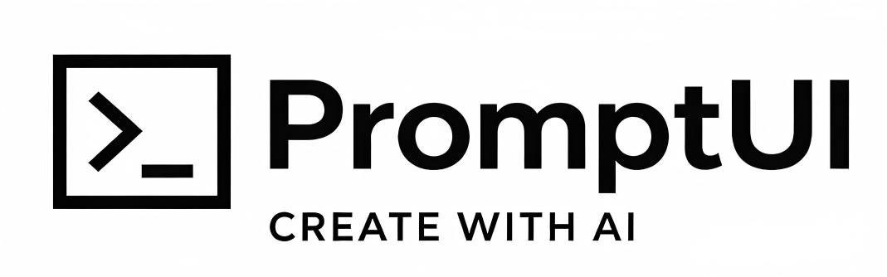

# PromptUI

English | [简体中文](./README.md)

PromptUI is a `Vue 3 + FastAPI` prompt management system for real product workflows.
It supports categorized browsing, search/filtering, code-asset preview, prompt authoring/publishing, and admin moderation.




## Features

- Full-stack deployment with `docker compose`
- Auth system (JWT + refresh token)
- Forced admin bootstrap on first run (`/admin-setup` when no admin exists)
- Prompt lifecycle management (create, edit, publish, unpublish, delete)
- Category and tag filtering
- Code asset storage (`code_assets`: HTML/CSS/JS)
- Frontend preview rendered from backend data, not static local demo components
- Bilingual UI support (`vue-i18n`, Chinese/English)

## Tech Stack

- Frontend: `Vue 3`, `Pinia`, `Vue Router`, `vue-i18n`, `Axios`
- Backend: `FastAPI`, `SQLAlchemy`, `Pydantic`, `Alembic`
- Database: `PostgreSQL`
- Cache: `Redis`
- Deployment: `Docker Compose`

## Quick Start (Docker)

1. Start all services

```bash
docker compose up -d --build
```

2. Open frontend

- `http://localhost:5173/#/`

3. First-time initialization

- If no admin account exists, the app redirects to `/#/admin-setup`
- The first registered account is automatically assigned as `admin`

## Local Development (Optional)

Frontend:

```bash
npm install
npm run dev
```

Backend:

```bash
cd backend
pip install -r requirements.txt
uvicorn app.main:app --reload --port 8000
```

## Project Structure

- `src/` frontend source
- `backend/app/` backend source
- `backend/alembic/` database migrations
- `docker-compose.yml` full-stack orchestration

## Troubleshooting

- Empty preview: verify the prompt has `code_assets.html/css/js`.
- Login redirect behavior: protected routes redirect to `/#/login` with `redirect` query.
- Forced admin bootstrap: when `GET /api/v1/auth/status` returns `needs_admin_setup=true`, route guards redirect to `/#/admin-setup`.

## License

MIT
